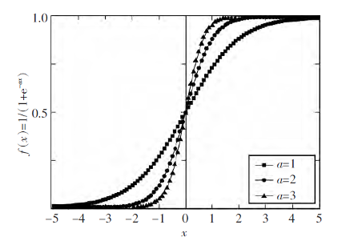

## 步进电机曲线加速原理

### 一.步进电机脉冲分析

适用于步进电机使用脉冲的驱动方式，脉冲频率表示电机的速度。即表示步进电机获得一个脉冲周期电机转动一个固定的角度。

电机需要平滑的加速运动，速度变化过于急促或者不合理电机容易出现卡死的现象，加速过慢会不能及时到达所需的工作频率。

本方法在单片机上得到验证。

### 二.单片机定时器使用原理

电机输出脉冲一般采用单片机定时器输出，定时器频率由总线主频分频而来，由于是分频会出现分母（也就是分频系数）偏小的时候，小的改变会造成频率变化大。分频系数小的时候输出频率大，此时输出频率改变再过大，电机十分容易出现卡死现象。

电机启动时频率过高或者变化过快，由于电机的启动惯性依然可能出现卡死现象。

定时器总线频率Fmax；分频系数PSC，装载值ARR，最终输出频率：

F = Fmax/PSC/ARR           									 （1）

### 三.曲线加速原理以及采用函数

采用公式计算获得曲线加速，最终选择logistic函数作为分频系数或者装载值的计算，然后使用计算结果值来改变定时器频率达到改变电机速度的原理。函数原型：

f(x) = 1/(1+e^(-ax))                   								（2）

函数中a为函数倾斜参数，控制函数的斜率，a 值越大曲线的线性部分斜率越大。当x 取一组对称数列，如-5，-4.9，…，0，…，4.9，5 时，a 分别取值1.0，2.0，3.0，对应的曲线如图1 所示。可以看出，曲线均呈S 形且中心对称，开始增长缓慢，然后在某一范围内迅速增长，达到一定程度后，增长又缓慢下来，最终趋于一个稳定值。这正好适合电机的加速轨迹。

我们将logistic函数离散化,x值在自定义范围取离散点f(x)则可以得出离散点在区间[0,1]。

logistic函数的图像

### 四.函数曲线应用

我们要使用该函数的变化规律应用起来，需要将函数自变量的区间与实际区间对应。再将因变量与实际结果对应。对应方式使用线性对应即可完成。

本方法采用改变定时器的装载值来改变定时器输出频率的方法，如下定义相关参数。

**A**： 定时器最大装载值，也就是输出频率最小时的装载值。

**B**： 定时器最小装载值，也就是输出频率最大时的装载值。

**L**： L=A-B；表示装载值最大间隔，这里作为函数的步进变化总步数。

**T0**：logistic函数区间首参数。

**T1**：logistic函数区间末参数。

**R**： R=(T1-T0)/L；表示函数步进精度，总变化值除以总步数。

**S**： 速度斜率，logistic斜率参数。

**Y**： 速度映射值，logistic函数对应结果。

**X**： 装载步数，区间[0,L]。

**Q**： 装载值。

曲率函数得出的结果在装载函数中作为系数的存在。B实则是函数起点的对应装载值，Y可以看做分步的映射参数，它的变化规律就是logistic函数的变化规律。区间依然只在[0,1]之间，L是装载值的间隔值。可以看出结果区间在[B,A]。

**函数改写成曲率函数如下格式：**

Y = 1/(1+e^(S(T0+XR)))              									 （3）

**装载函数：**

Q=YL+B               															（4）

**注意及说明：**

1.调整T0和T1可以调整函数起点和终点的位点，也就是可以调整速度变化开始或者结束段的变化精度。

2.调整S值可以调整速度斜率，可以看图1。

3.编程中使用函数时，由于使用单片机综合考虑计算能力，可以在驱动电机运动前计算整个加速或者减速区间对应的速度参数，然后在驱动电机过程中通过查表方式来装载对应值，即可减轻计算压力。使用空间换取时间。